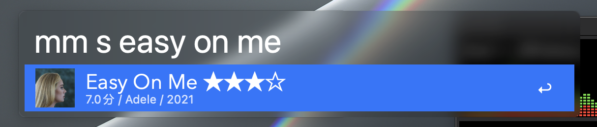

# douban workflow for Alfred

#### macOS 在 12.3Beta 中移除了对 Python2.7 的支持, 导致此前所有使用 python 的 workflow 都将失效.

#### 此项目已经支持 Python3, 由于 Python3 并非 macOS 内置, 所以你需要手动安装.

#### 安装方法请搜索"brew install python3"

---

豆瓣条目搜索, 可实现所有条目一站式查询, 包括图书, 电影, 音乐, app 等

### 使用方式:

```
	mm <query>
```


支持类别过滤, 目前有四种模式--影视,音乐, 图书, 其他, 对应关键词为--v, s, b, o.

如,只搜索音乐:

```
	mm s easy on me
```


